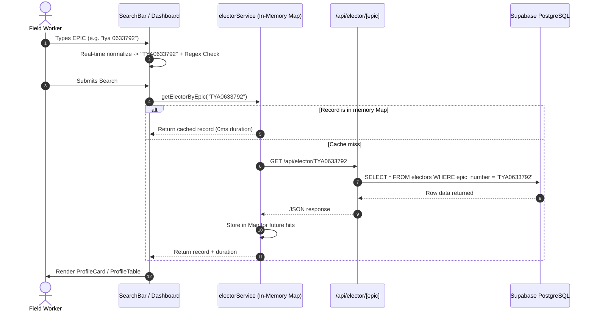
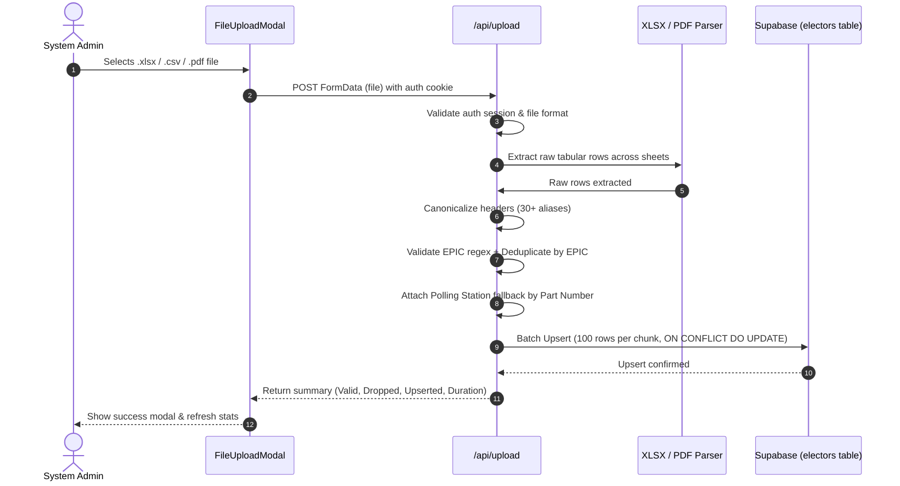

# 🏛️ AI-Understandable Project Architecture & Claude Feature Discussion Prompt

> **Generated:** 2026-10-05  
> **Target Project:** Elector Lookup Portal (Karnataka MLC & Assembly Voter Operations)  
> **Edition:** v3.1 — Extended Demographics, In-App Data Ingestion & Live Editing

---

## 📑 Document Structure
1. [Part 1: AI-Understandable System Architecture Dossier](#part-1-ai-understandable-system-architecture-dossier)
   - [1. Executive System Overview](#1-executive-system-overview)
   - [2. Technology Stack & Runtime Matrix](#2-technology-stack--runtime-matrix)
   - [3. Complete Directory & File Manifest](#3-complete-directory--file-manifest)
   - [4. Database Schema & Index Specifications](#4-database-schema--index-specifications)
   - [5. System Architecture & Data Flow Diagrams](#5-system-architecture--data-flow-diagrams)
   - [6. Current Technical Debt & Constraints](#6-current-technical-debt--constraints)
2. [Part 2: Master Discussion Prompt for Claude](#part-2-master-discussion-prompt-for-claude)
   - [Copy-Paste Ready Prompt for Claude 3.5 / 3.7 Sonnet](#copy-paste-ready-prompt-for-claude)
3. [Part 3: Candidate Feature & Module Modernization Matrix](#part-3-candidate-feature--module-modernization-matrix)

---

# Part 1: AI-Understandable System Architecture Dossier

## 1. Executive System Overview

The **Elector Lookup Portal** is an enterprise-grade internal web portal and dual-engine data ingestion pipeline engineered for political operations, field teams, and electoral roll administrators. It replaces unwieldy multi-page municipal PDF electoral rolls and giant spreadsheets with a sub-second search engine and demographic intelligence platform.

### Core Value Proposition
- **Sub-Second Lookup:** Sub-millisecond B-Tree indexed queries coupled with client-side in-memory Map caching for 0ms repeated searches.
- **Strict Input Normalization:** Client-side real-time regex sanitization (`^[A-Z]{3}\d{7}$`) guaranteeing that only valid 10-character EPIC numbers query backend infrastructure.
- **Dual Presentation Modes:** High-impact visual **Profile Card** with demographic badges + tabular **Profile Table** optimized for single-sheet A4 printing (`@media print`).
- **In-App Data Lifecycle:** Built-in modal editors for live record patching (`PATCH /api/elector/[epic]`) and in-browser bulk dataset upload (`POST /api/upload`).
- **Zero-Cost Footprint:** Engineered to run 100% within free-tier limits (Supabase PostgreSQL 500MB + Vercel Hobby tier).

---

## 2. Technology Stack & Runtime Matrix

| Tier | Technology | Version | Purpose |
| :--- | :--- | :--- | :--- |
| **Frontend Framework** | Next.js (App Router) | `14.2.24` | React Server Components, Edge Routing, API Handlers |
| **UI Library** | React | `18.3.1` | Declarative UI, Client-side state & modals |
| **Language** | TypeScript | `5.7.3` | Strict type safety across client, server, and ETL |
| **Styling** | Tailwind CSS | `3.4.17` | Utility-first CSS, responsive breakpoints, print styles |
| **Icons** | Lucide React | `0.475.0` | Modern SVG interface icons |
| **Database** | Supabase (PostgreSQL) | `15.x` | Managed cloud Postgres, RLS enforcement, B-Tree indexing |
| **Auth & Session** | Custom Session Cookie / Supabase Auth | — | HTTP-Only cookie verification via Edge Middleware |
| **Web Ingestion** | `xlsx` + `pdf-parse` | `0.18.5` / `1.1.1` | Serverless in-app Excel & PDF text extraction |
| **Offline ETL** | Python | `3.12.x` | Heavy extraction, cleaning, OCR, and bulk psycopg2 COPY |
| **ETL Libraries** | `pandas`, `openpyxl`, `pdfplumber`, `psycopg2-binary` | Latest | Multi-sheet parsing, column normalization, COPY upsert |
| **Deployment Target** | Vercel (Hobby) / Netlify | — | Global edge CDN, serverless API execution |

---

## 3. Complete Directory & File Manifest

```
electoral-portal-main/
│
├── AGENTS.md                                # Master AI instructions, strict guardrails & project rules
├── progress.md                              # Phase-by-phase build log (Phases 1-4 status)
├── README.md                                # Comprehensive system readme & operational playbook
├── netlify.toml / .vercelignore             # Cloud deployment configurations
├── package.json / tsconfig.json             # Root configs
│
├── docs/                                    # 📚 Technical Specifications & Architectural Guides
│   ├── architecture.md                      # In-depth system design & component diagrams
│   ├── database-schema.md                   # DDL, query plans, index analysis, RLS security matrix
│   ├── etl-guide.md                         # Detailed Python ETL operational manual
│   ├── deployment-guide.md                  # Vercel & Supabase release playbook
│   ├── testing-strategy.md                  # QA testing matrices
│   ├── security-checklist.md                # Security audit and data isolation checklist
│   ├── open-questions.md                    # Unresolved client decisions log
│   ├── Updated_Build_Prompt_Polling_Address.md # Detailed polling booth specification addendum
│   └── AI_SYSTEM_ARCHITECTURE_AND_CLAUDE_PROMPT.md # This document
│
├── etl/                                     # 🐍 Python 3.12 Offline ETL Pipeline
│   ├── extract.py                           # Auto-detects header rows, parses sheets & extracts text from PDFs
│   ├── clean.py                             # Maps 30+ column variations, cleans strings, handles nulls
│   ├── validate.py                          # Enforces regex, drops corrupted records, deduplicates by EPIC
│   ├── ingest.py                            # High-speed psycopg2 COPY upsert & Supabase REST fallback
│   ├── main.py                              # CLI orchestrator (--source, --ingest, --dry-run, --polling-map)
│   ├── polling.py                           # Logic for mapping Part numbers to Polling stations
│   ├── schema.sql                           # Supabase DDL, B-tree indexes, RLS policies
│   ├── requirements.txt                     # Python dependencies
│   └── .env.example                         # Credentials template (SUPABASE_URL, SERVICE_ROLE_KEY, DATABASE_URL)
│
├── scripts/                                 # 🛠️ Node.js Rapid Inspection & Verification Utilities
│   ├── inspect_excel.js                     # Terminal inspection of raw workbook layouts
│   ├── test_smart_parser.js                 # Positional regex table extractor test
│   ├── dump-polling-mapping.js              # Polling booth JSON dumper
│   ├── inspect-tumkur-mapping.js            # District-specific polling part tester
│   └── verify_file_voters.js                # Row counting and fast integrity audit
│
├── web/                                     # ⚡ Next.js 14 Web Application
│   ├── app/
│   │   ├── layout.tsx                       # Root HTML shell, fonts, meta tags
│   │   ├── page.tsx                         # Entry route: redirects to /dashboard or /login
│   │   ├── globals.css                      # Tailwind setup & @media print styles
│   │   ├── login/page.tsx                   # Credentials authentication view
│   │   ├── dashboard/
│   │   │   ├── layout.tsx                   # App shell header, logo branding, live stats badge, logout
│   │   │   └── page.tsx                     # Main search page, cache integration, prefetcher, modals
│   │   ├── profile/[epic]/page.tsx          # Dynamic profile route (loads ProfileDisplay)
│   │   └── api/
│   │       ├── auth/
│   │       │   ├── login/route.ts           # Verifies credentials, sets 7-day HTTP-Only cookie
│   │       │   └── logout/route.ts          # Invalidates session cookie
│   │       ├── elector/[epic]/route.ts       # GET: fetch single elector | PATCH: update voter record
│   │       ├── stats/route.ts               # Returns exact total elector count from Supabase
│   │       └── upload/route.ts              # In-app file parser (Excel/PDF) with batch upsert
│   │
│   ├── components/
│   │   ├── SearchBar.tsx                    # EPIC input with instant formatting, regex validation, keyboard nav
│   │   ├── ProfileDisplay.tsx               # Orchestrates Card & Table views, fast search, copy slip generator
│   │   ├── ProfileCard.tsx                  # Visual profile with demographic chips, contact info, polling station
│   │   ├── ProfileTable.tsx                 # 2-column tabular view with printable formatting
│   │   ├── ViewToggle.tsx                   # Interactive Card ↔ Table mode toggle
│   │   ├── EditElectorModal.tsx             # Interactive modal to edit voter info & sync with database
│   │   ├── FileUploadModal.tsx              # Drag-and-drop modal to upload Excel/PDF datasets directly in browser
│   │   ├── RecentSearches.tsx               # Client-side history of recent voter lookups
│   │   ├── PhotoPlaceholder.tsx             # Initials-based avatar generator (photo fallback)
│   │   ├── EmptyState.tsx                   # Friendly missing record UI with search link
│   │   ├── LiveRecordBadge.tsx              # Real-time animated counter showing records in database
│   │   └── LogoutButton.tsx                 # Session termination button
│   │
│   ├── lib/
│   │   ├── electorService.ts                # In-memory Map cache (0ms instant hits), prefetcher, API client
│   │   ├── searchHistory.ts                 # LocalStorage search history manager
│   │   ├── types.ts                         # Interfaces: Elector, ElectorDisplayData, FIELD_LABELS
│   │   ├── utils.ts                         # normalizeEpic, isValidEpic, formatEpicForDisplay, cn
│   │   └── supabase/
│   │       ├── client.ts                    # Browser Supabase client (anon key)
│   │       └── server.ts                    # Server Supabase client (service role key)
│   │
│   ├── middleware.ts                        # Next.js Edge route guard protecting /dashboard & /profile
│   └── package.json                         # Web dependencies and dev scripts
```

---

## 4. Database Schema & Index Specifications

### Live PostgreSQL Table Definition (`electors`)

```sql
CREATE TABLE IF NOT EXISTS electors (
    -- Primary Identifier & Electoral Index
    id                    BIGSERIAL PRIMARY KEY,
    serial_number         INTEGER,                      -- Voter serial number in roll
    epic_number           VARCHAR(11) NOT NULL UNIQUE,  -- Primary business key (e.g. TYA0633792)

    -- Personal & Demographic Data
    name                  TEXT NOT NULL,                -- Elector's full name
    relative_name         TEXT,                         -- Father's / Husband's name
    address               TEXT,                         -- Residential address
    qualification         VARCHAR(100),                 -- Educational qualification
    occupation            VARCHAR(100),                 -- Profession / Employment
    age                   INTEGER,                      -- Elector age
    sex                   CHAR(1) CHECK (sex IN ('M', 'F')),

    -- Extended Demographics & Contact
    whatsapp_mob          VARCHAR(20),                  -- WhatsApp / Mobile contact number
    caste                 VARCHAR(100),                 -- Community / Caste classification

    -- Local Administrative Hierarchy (Karnataka specific)
    district              VARCHAR(100),                 -- District (e.g. Tumkur, Davanagere)
    ac_name               VARCHAR(100),                 -- Assembly Constituency Name
    taluk                 VARCHAR(100),                 -- Taluk administration
    hobli                 VARCHAR(100),                 -- Revenue circle / Hobli
    grama_panchayath      VARCHAR(100),                 -- Gram Panchayat
    village               VARCHAR(100),                 -- Village name
    area_ward             VARCHAR(100),                 -- Ward / Local area name

    -- Polling Booth & Voting Location
    part_number           VARCHAR(20),                  -- Electoral Roll Part Number (e.g. 92, 45A)
    polling_station_name  TEXT,                         -- Station facility name
    polling_address       TEXT,                         -- Physical station address & landmark

    -- Media & Auditing
    photo_url             TEXT,                         -- Reserved for future photo integration (NULL in v1)
    created_at            TIMESTAMPTZ DEFAULT NOW(),
    updated_at            TIMESTAMPTZ DEFAULT NOW()
);

-- Primary Unique B-Tree Index for sub-millisecond lookups
CREATE UNIQUE INDEX IF NOT EXISTS idx_electors_epic_number 
    ON electors (epic_number);
```

### Security & Row Level Security (RLS) Configuration

```sql
-- Enable PostgreSQL RLS
ALTER TABLE electors ENABLE ROW LEVEL SECURITY;

-- Allow authenticated users to query voter records
CREATE POLICY "Authenticated users can read electors"
    ON electors FOR SELECT
    TO authenticated
    USING (true);

-- Explicitly deny unauthenticated / public access
CREATE POLICY "Anonymous users cannot read electors"
    ON electors FOR SELECT
    TO anon
    USING (false);
```

---

## 5. System Architecture & Data Flow Diagrams

### 5.1 Search & In-Memory Cache Flow



### 5.2 In-App Dataset Ingestion Flow



---

## 6. Current Technical Debt & Constraints

1. **Search Limitations:** Search is currently restricted to exact 10-character EPIC match. Field workers often only have a voter's name, mobile number, or booth number.
2. **In-Browser Upload Execution Timeout:** Next.js Route Handlers on Vercel Hobby tier have a 10s to 60s timeout. Processing a 100,000-row workbook directly in `/api/upload` risks timing out.
3. **Session Management:** Auth currently utilizes a lightweight base64 cookie with preset accounts (`admin`, `operator`). It needs to be upgraded to standard Supabase Auth JWTs with role-based policies.
4. **Voter Photo Status:** The `photo_url` column is present in the schema but stays `NULL` across all records. No automated image extraction pipeline is connected yet.
5. **Data Denormalization:** Polling station names and addresses are duplicated across thousands of electors sharing the same Part number.

---

# Part 2: Master Discussion Prompt for Claude

> **Copy everything inside the block below and paste it into Claude (Claude 3.5 Sonnet / 3.7 Sonnet).**

***

```markdown
# Role & Project Briefing: Principal Full-Stack Architect & Electoral Systems Engineer

You are acting as the Lead Technical Architect for the **Elector Lookup Portal** — an internal, high-performance web platform and data pipeline designed for election field operations, voter roll verification, and demographic lookup (specifically for Karnataka Assembly & Legislative Council constituencies).

I need your deep technical guidance to:
1. Review the existing system architecture and code modules.
2. Discuss and prioritize **new high-impact features** to add to the application.
3. Identify **module refactoring and modernization opportunities** (security, scaling, search capabilities, ingestion performance, and mobile field-readiness).

---

## 1. Project Context & Current Architecture

### 1.1 Tech Stack
- **Frontend:** Next.js 14.2 (App Router), React 18, TypeScript 5.7, Tailwind CSS 3.4, Lucide React
- **Backend / Database:** Supabase (PostgreSQL 15), Serverless Route Handlers
- **Data Ingestion:**
  - Offline Python 3.12 pipeline (`pandas`, `openpyxl`, `pdfplumber`, `psycopg2-binary`)
  - Live In-App Upload Route (`web/app/api/upload/route.ts` using `xlsx` and `pdf-parse`)
- **Cost Target:** 100% Free-Tier footprint (Supabase 500MB DB, Vercel Hobby hosting)

### 1.2 System File Structure
```
electoral-portal-main/
├── etl/                               # Offline Python ETL Pipeline
│   ├── extract.py, clean.py, validate.py, ingest.py, main.py, polling.py, schema.sql
├── web/                               # Next.js 14 Web Application
│   ├── app/
│   │   ├── dashboard/page.tsx         # Instant Search UI, stats badge, cache integration
│   │   ├── profile/[epic]/page.tsx    # Voter detail route (Card & Table views)
│   │   ├── login/page.tsx             # Authentication interface
│   │   └── api/
│   │       ├── elector/[epic]/route.ts # GET single voter, PATCH live field editing
│   │       ├── upload/route.ts        # In-browser multi-sheet Excel & PDF ingestion
│   │       ├── stats/route.ts         # Supabase exact count endpoint
│   │       └── auth/login & logout    # Session cookie handlers
│   ├── components/
│   │   ├── SearchBar.tsx              # Strict regex & input normalizer (^[A-Z]{3}\d{7}$)
│   │   ├── ProfileDisplay.tsx         # Card/Table switch, Edit modal trigger, Copy slip
│   │   ├── ProfileCard.tsx            # Demographic badges & details grid
│   │   ├── ProfileTable.tsx           # Printable 2-column layout (with @media print styles)
│   │   ├── EditElectorModal.tsx       # Live voter record update form
│   │   ├── FileUploadModal.tsx        # File drag-and-drop modal for batch ingestion
│   │   ├── LiveRecordBadge.tsx        # Real-time record counter
│   │   └── RecentSearches.tsx         # LocalStorage history tracker
│   ├── lib/
│   │   ├── electorService.ts          # In-memory Map cache (0ms instant hits), prefetcher
│   │   ├── types.ts                   # TypeScript interfaces (Elector, ElectorDisplayData)
│   │   ├── utils.ts                   # EPIC sanitizers & formatters
│   │   └── supabase/client.ts & server.ts # Supabase SSR clients
│   └── middleware.ts                  # Edge route guard for /dashboard & /profile
```

### 1.3 Live Database Schema (`electors` table)
```sql
CREATE TABLE electors (
    id                    BIGSERIAL PRIMARY KEY,
    serial_number         INTEGER,
    epic_number           VARCHAR(11) NOT NULL UNIQUE,  -- Format: 3 letters + 7 digits (e.g. TYA0633792)
    name                  TEXT NOT NULL,
    relative_name         TEXT,
    address               TEXT,
    qualification         VARCHAR(100),
    occupation            VARCHAR(100),
    age                   INTEGER,
    sex                   CHAR(1) CHECK (sex IN ('M', 'F')),
    
    -- Demographics & Regional Hierarchy
    whatsapp_mob          VARCHAR(20),
    caste                 VARCHAR(100),
    district              VARCHAR(100),
    ac_name               VARCHAR(100),
    taluk                 VARCHAR(100),
    hobli                 VARCHAR(100),
    grama_panchayath      VARCHAR(100),
    village               VARCHAR(100),
    area_ward             VARCHAR(100),
    
    -- Polling Booth Mapping
    part_number           VARCHAR(20),
    polling_station_name  TEXT,
    polling_address       TEXT,
    photo_url             TEXT,                         -- Currently NULL / Reserved
    created_at            TIMESTAMPTZ DEFAULT NOW(),
    updated_at            TIMESTAMPTZ DEFAULT NOW()
);
CREATE UNIQUE INDEX idx_electors_epic_number ON electors (epic_number);
```

---

## 2. Key Modules to Discuss & Questions for You

I want us to systematically discuss the following 5 focus areas. Please provide your architectural assessment, trade-offs, and concrete recommendations for each:

### Area 1: Search Capabilities Expansion (Beyond Exact EPIC)
*Currently, search is limited to exact EPIC lookups (`^[A-Z]{3}\d{7}$`).*
- How should we implement **Fuzzy Name Search** (handling Kannada transliterations, spelling variations like "Suresh" vs "Sooresh") without blowing up Supabase CPU and memory on a 200,000+ row database? (e.g., PostgreSQL `pg_trgm`, GIN indexes, soundex/metaphone).
- How can we add **Filter by Mobile / WhatsApp number**, **Part / Booth Number**, and **Ward / Village**?
- What UI/UX pattern best preserves the current 0ms sub-second speed for EPIC lookups while providing multi-field search when needed?

### Area 2: Ingestion & Upload Architecture (Preventing Serverless Timeouts)
*Currently, `/api/upload/route.ts` parses uploaded Excel/PDF files in-memory in a single Next.js API request.*
- On Vercel, serverless functions timeout after 10–60 seconds. A 50,000-row Excel or 500-page PDF will hit execution limits.
- What is the best pattern to handle large file uploads without paying for dedicated Redis/Celery workers? (e.g., Direct upload to Supabase Storage Bucket -> Postgres Webhook / Edge Function, Chunked client-side streaming batches, or Browser Web Workers).
- How should we improve PDF electoral roll extraction (which frequently has complex tabular text columns and scanned kannada/english fonts)?

### Area 3: Field Operations, WhatsApp & Voter Slip PDF Generation
*Field workers frequently need to send voters their details or print physical slips.*
- How can we build an **Instant Voter Slip PDF** generator (client-side via `@react-pdf/renderer` or `jspdf`) formatted for mobile thermal printers (58mm/80mm) and standard A4 paper?
- How can we add a **1-Click WhatsApp Dispatch** that formats voter slips into ready-to-send WhatsApp messages with Part number, Booth location, and Google Maps links?
- What are the privacy and rate-limiting considerations for this?

### Area 4: Authentication, Audit Trail & Role-Based Access Control (RBAC)
*Currently, auth uses a lightweight preset session cookie (`elector_auth_session`).*
- How should we upgrade this to a secure Supabase Auth JWT setup with role separation:
  - `Admin`: Full access, upload datasets, manage users, bulk export.
  - `Data Operator`: Edit elector records, upload updates.
  - `Field Agent`: Read-only search, share WhatsApp voter slip, log field visit status.
- How can we implement an `audit_logs` table in PostgreSQL to track who edited an elector or who searched which records?

### Area 5: Voter Photo & OCR Processing Pipeline (Future Milestone)
*The `photo_url` column is currently NULL across all records.*
- If we obtain electoral PDFs with embedded passport photos or physical voter cards, what is the most cost-effective architecture to extract face photos, crop them, name them by EPIC number, upload to Supabase Storage or Cloudflare R2, and link them to `electors.photo_url`?

---

## 3. How I Want You to Respond

1. **Executive Evaluation:** Give your quick critique of the current architecture and identify any immediate bottlenecks or security holes.
2. **Prioritized Feature Matrix:** Categorize proposed enhancements into **Phase A (Immediate Quick Wins - 1 to 2 days)**, **Phase B (Mid-term Operational Features - 1 week)**, and **Phase C (Major Architectural Upgrades)**.
3. **Deep Dive & Implementation Architecture:** Pick the top 2 most urgent areas from above and provide:
   - Database schema changes (DDL / migrations).
   - Component & API route design.
   - Example code or step-by-step logic.
4. **Interactive Discussion Prompt:** Conclude by asking me 3 specific questions to clarify our operational constraints so we can decide the exact next feature to build.
```

***

---

# Part 3: Candidate Feature & Module Modernization Matrix

To help structure upcoming sprints, here is the functional breakdown of what can be added and what can be refactored:

```
┌────────────────────────────────────────────────────────────────────────────────────────┐
│                        ELECTOR LOOKUP PORTAL ROADMAP                                   │
└────────────────────────────────────────────────────────────────────────────────────────┘

 [Phase A: Immediate High-Impact Wins (1 - 2 Days)]
 ├── 1. 1-Click WhatsApp Slip Sender (with Booth details & Google Maps location link)
 ├── 2. Direct Mobile Thermal Printer & PDF Voter Slip Generator (58mm/80mm slips)
 ├── 3. Phone / WhatsApp Number Direct Lookup
 └── 4. Part / Booth Filter Dropdown on Dashboard

 [Phase B: Core Operations & Scaling (1 Week)]
 ├── 1. Trigram-Based Fuzzy Name Search (`pg_trgm` GIN index with pagination)
 ├── 2. Chunked Client-Side Ingestion (Streaming 1,000-row chunks to prevent Vercel 60s timeout)
 ├── 3. Role-Based Access Control (Admin vs Data Operator vs Field Volunteer)
 ├── 4. Field Verification Tagging ("Visited", "Shifted", "Deceased", "Voted")
 └── 5. Audit Logging Table (`elector_audit_logs` for all edits and deletions)

 [Phase C: Advanced Enterprise Capabilities]
 ├── 1. Voter Photo Extraction & Cloudflare R2 / Supabase Storage Pipeline
 ├── 2. Offline PWA (Progressive Web App) with IndexedDB Booth Sync for zero-connectivity zones
 ├── 3. Real-Time Turnout & Booth-Level Analytics Dashboard
 └── 4. Bulk CSV Export with Granular Field Filtering (Admin Only)
```

---
*End of Document. This file is preserved in the repository at `docs/AI_SYSTEM_ARCHITECTURE_AND_CLAUDE_PROMPT.md` for continuous AI agent collaboration.*
